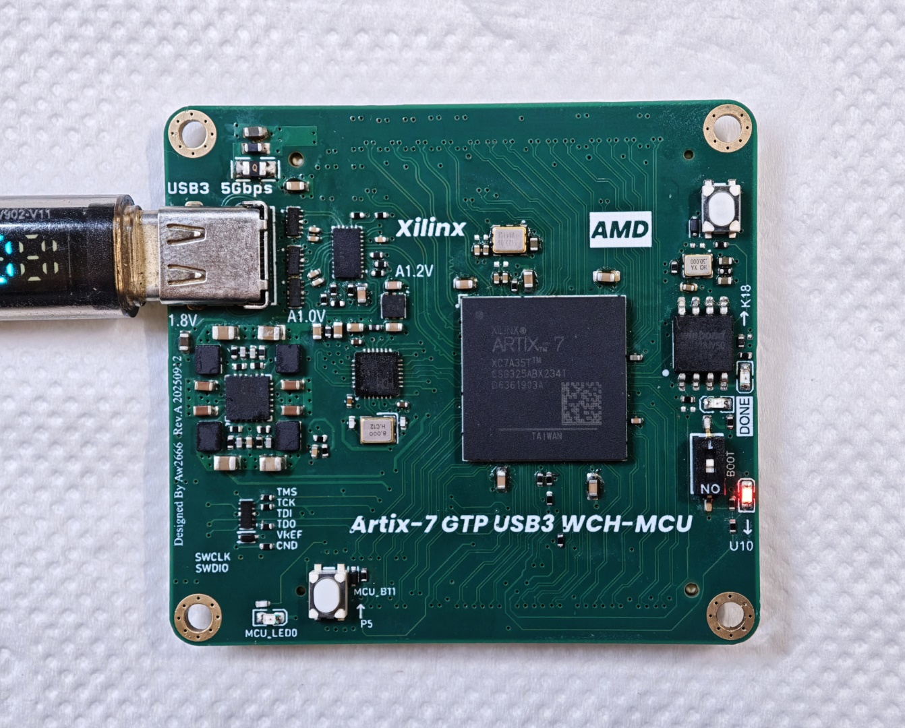
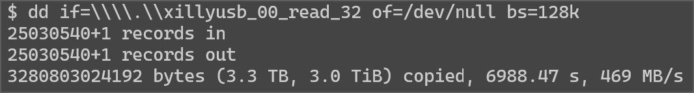

# 硬件

四层板设计，提供20+30对差分对，共100个引出引脚，使用两个80pin 0.8mm BTB连接器，板上包含2.5V电压，可用于LVDS外设。

也可以见JLC的OSHW开源链接：（待补充）

## 电源

EA3059提供3.3V 2.5V 1.8V 1.0V四路电压到FPGA IOB和内核供电，3.3V也提供到单片机的VIO和VDD.

GTP供电包含1.0V和1.2V,分别由1.0V过磁珠后提供和1.8V过磁珠和TLV733P-Q1后提供，可以通过7_Series_XPE_2019_1_2.xlsm来评估GT功耗，考虑最大情况也够用。

## 引出引脚

### CN7：

80Pin 0.8mm BTB连接器（X0802FVS-80AS-LPV01），底座可使用对插型号或其他兼容型号。

包含一个5V和一个BANK15电压引出（2.5V默认）;

包含GTP TRX1-3差分对和一对GTP外部输入时钟。

提供BANK15的20对差分对，在BANK15保持2.5V的情况下可用于LVDS应用。

提供从串加载所需要的的时钟线和数据线（PROGRAM_B在CN8 上，需要配合使用）。

### CN8:

80Pin 0.8mm BTB连接器（X0802FVS-80AS-LPV01），底座可使用对插型号或其他兼容型号。

提供5V/3.3V/2.5V/1.8V电压；

提供BANK34上的14对差分对 ,BANK14上的16对, 默认为3.3V，如果需要更多的LVDS连接，修改电源处为2.5V即可（需要Flash支持）

提供PROGRAM_B/FPGA_DONE用于从串加载配置。

## FPGA

FPGA型号为Xilinx ``XC7A35TCSG325-2``。

通过拨码开关切换到 ``ON`` 可以使用从串加载模式来加载FPGA，反之为SPI FLASH自加载模式启动（BTB连接器引出从串加载引脚）。

JTAG引脚通过板对线连接器引出，同时连接到单片机引脚

> 使用单片机模拟FT2232H可以实现在板一线通调试，见项目：[alwaysmy/CH32V30x_FT2232H_XilinxJtagCable](https://github.com/alwaysmy/CH32V30x_FT2232H_XilinxJtagCable)

FPGA到单片机CH32V305G的连接包含UART/IIC/SPI/GPIO等外设。

USB3.0 Type-C接口的USB2.0连接到单片机的USBHS，其USB3信号线连接到FPGA的GTP差分对。

FPGA引出两个LED，独占一个按键，和单片机共用一个按键BT1。

外部IO均包含ESD, BTB连接器不包含ESD.

### 时钟

GT时钟为差分LVDS 125M晶振。

板载50M单端时钟，可以作为时钟输入。

配置GTP之后，也可以使用GTP引出的时钟作为逻辑时钟输入。

### FLASH

这里使用的Flash是W25Q128JVSIQ，vivado中默认没有这个型号选择，但是实际上支持，可以手动添加型号来烧录。

### USB3设计

GTP直连USB设计，使用带CC控制的信号MUX来切换USB3差分对。可以自行开发逻辑，也可以参考Xillyusb的实现，**注意**，Xillyusb的免费授权仅限于于非商业评估应用，商业授权请自行联系。

7系的GT设计只能实现USB3 5Gbps，无法实现10Gbps.

## 单片机

8M无源晶振。

外设连接到FPGA上,常用的功能包含UART7/SPI1/SPI2/UART3或IIC,更多外设功能详见对应引脚在CH32V30x数据手册中引脚复用章节的说明。

单片机引出一个LED，和FPGA共用一个按键BT1.

单片机的SWD接口和FPGA JTAG接口共用一个连接器。

## 功耗

使用这个项目测试，[hdlguy/heater: An FPGA "heater" design to use LFSR data to toggle logic for the purpose of stressing the power supply.](https://github.com/hdlguy/heater)测试的最大逻辑功耗是3W,如果有更多的IO使用以及GTP使用，功耗会更高。3W下风冷无散热器情况下温升45℃大概(内部传感器读取).

板卡总功率超过1.5W最好添加散热器或空气流动。

# 应用和例程解释

1、Firmware下有一个USB3的测速工程，来源于XillyUSB项目

测速结果如下：

Windows10,5600x,64G Memory,使用主板上TYPE-C口，单独读测速：

使用TYPE-A口测试速度则低一些，我的环境下是419MB/s.

Ubuntu 24,虚拟机，物理机为上述主机。同时读写：

RK3576(nanopi) 读出：

2、Read 200M 16Bit ADC to PC through USB3

使用这个项目中开源的ADC模块（完善中）。

3、单片机协同配置

（完善中）

# JTAG下载器

1、板载单片机可以使用这个项目中的程序来作为下载器,支持Vivado下载，烧写flash,ILA：

[alwaysmy/CH32V30x_FT2232H_XilinxJtagCable](https://github.com/alwaysmy/CH32V30x_FT2232H_XilinxJtagCable)

2、或者使用WCH官方的这个项目[openwch/usb-jtag-spi: Single-chip solution for Hi-speed USB2.0(480Mbps) JTAG/SPI Debugger based on RISC-V MCU CH32V30x/CH32V20x](https://github.com/openwch/usb-jtag-spi)，但是不直接持Vivado，可以使用OpenOCD或者XVC修改来支持

3、可以使用外部下载器，例如FT2232H/FT232H,这时候需要单片机未使用或者JTAG对应的IO配置为输入。

# 修改说明

FPGA原则上可以兼容XC7A50TCSG325-2

对于速度等级为-1的FPGA，由于GT速度较低，理论上不够USB3.0使用。

BANK电压未设计切换功能，但是设计中考虑了供电范围，可以直接通过修改EA3059的配置电阻来改变电压。由于BANK34和BANK0，BANK14都接在3.3V上，修改也是一起修改，注意，如果修改到1.8V，CFGBVS的选焊电阻需要切换，Flash需要使用支持1.8V的型号，部分厂家如GD具有宽电压型号。部分型号差分晶振不完全支持1.8V供电，注意手册，这里所用的型号选择对应的电压类型即可。

BANK15是单独的2.5V,可以任意修改。

单片机的晶振可以更换，根据手册，其范围为3MHz-25MHz, 如果不使用USBHS,可以不安装晶振，如果修改了晶振后使用USBHS，需要修改usb_dc_init中的初始化内容寄存器配置，或者重定义usb_dc_low_level_init()来添加时钟源配置分频修改。

