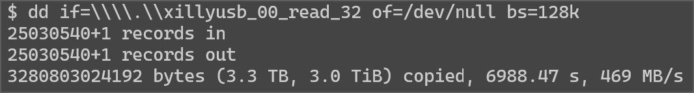
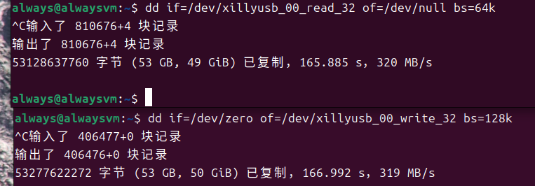
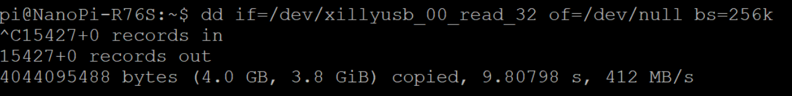

# 硬件

## FPGA

基于Xilinx XC7A35TCSG325-2

四层板设计

提供20+30对差分对，共100个引出引脚，板上包含2.5V电压，可用于LVDS外设。

SPI FLASH自加载模式启动或从串加载启动。

引出从串加载引脚，通过拨码开关切换可以使用从串加载模式

JTAG引脚通过板对线连接器引出，同时连接到单片机，

使用单片机模拟FT2232H可以实现一线通调试，见项目：[alwaysmy/CH32V30x_FT2232H_XilinxJtagCable](https://github.com/alwaysmy/CH32V30x_FT2232H_XilinxJtagCable)

提供到单片机CH32V305G的UART/IIC/SPI/GPIO连接。

USB-C接口连接到单片机的USBHS和FPGA的GTP.

板载125M GT时钟。

板载50M单端时钟。

FPGA引出两个LED，独占一个按键，和单片机共用一个按键BT1，

单片机引出一个LED，和FPGA共用一个按键BT1.

单片机的SWD接口和FPGA JTAG接口共用一个连接器。

GTP直连USB设计。可以自行开发，也可以参考Xillybus的实现，**注意**，Xillyusb免费授权仅限于于非商业评估应用，商业授权请自行联系。

7系的GT设计只能实现USB3 5Gbps。

## 单片机

8M晶振。外设连接到FPGA上。

## 功耗

使用这个项目测试，[hdlguy/heater: An FPGA "heater" design to use LFSR data to toggle logic for the purpose of stressing the power supply.](https://github.com/hdlguy/heater)测试的最大逻辑功耗是3W,如果有更多的IO使用以及GTP使用，功耗会更高。3W下风冷无散热器情况下温升45℃大概(内部传感器读取).

板卡总功率超过1.5W最好添加散热器或空气流动。

# 逻辑应用

1、Firmware下有一个USB3的测速工程，来源于XillyUSB项目

测速结果如下：

Windows10,5600x,64G Memory,使用主板上TYPE-C口，单独读测速：

使用TYPE-A口测试速度则低一些，我的环境下是419MB/s.

Ubuntu 24,虚拟机，物理机为上述主机。同时读写：

RK3576(nanopi) 读出：

2、Read 200M 16Bit ADC to PC through USB3

使用这个项目中开源的ADC模块（完善中）。

3、单片机协同配置

（完善中）

# JTAG下载器

1、板载单片机可以使用这个项目中的程序来作为下载器,支持Vivado下载，烧写flash,ILA：

[alwaysmy/CH32V30x_FT2232H_XilinxJtagCable](https://github.com/alwaysmy/CH32V30x_FT2232H_XilinxJtagCable)

2、或者使用WCH官方的这个项目[openwch/usb-jtag-spi: Single-chip solution for Hi-speed USB2.0(480Mbps) JTAG/SPI Debugger based on RISC-V MCU CH32V30x/CH32V20x](https://github.com/openwch/usb-jtag-spi)，但是不直接持Vivado，可以使用OpenOCD或者XVC修改来支持

3、可以使用外部下载器，例如FT2232H,这时候需要单片机未使用或者JTAG对应的IO配置为输入。

